# ANSIBLE CONFIGURATION MANAGEMENT – AUTOMATE PROJECT 7 TO 10

In Projects 7 to 10 we had to perform a lot of manual operations to set up virtual servers, install and configure required software, deploy your web application. In this project we will be looking at how to automate most of this routine tasks. 

In the current architecture shown below 


Ideally, the webservers would be inside a secured network which cannot be reached directly from the Internet. Meaning that even DevOps engineers should not be able to SSH into the Web servers directly. To achieve this, we will be using Ansible client as a jumb box (Bastion Host). 

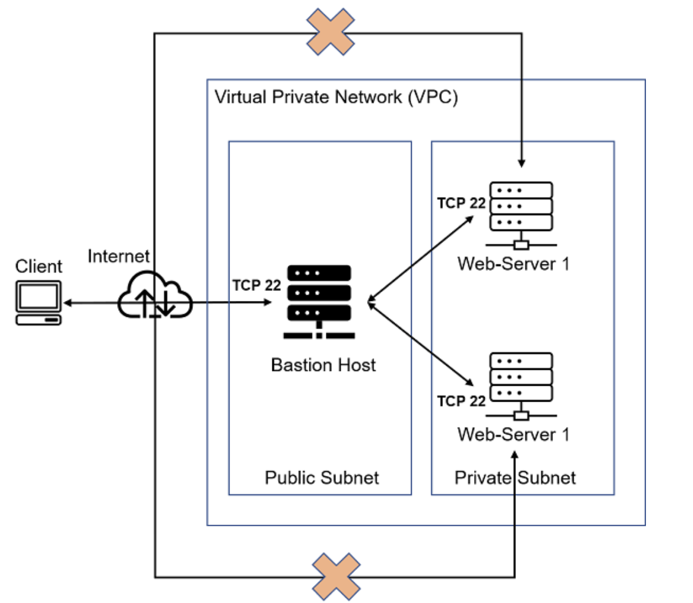

The Target architecture for this project is shown below:

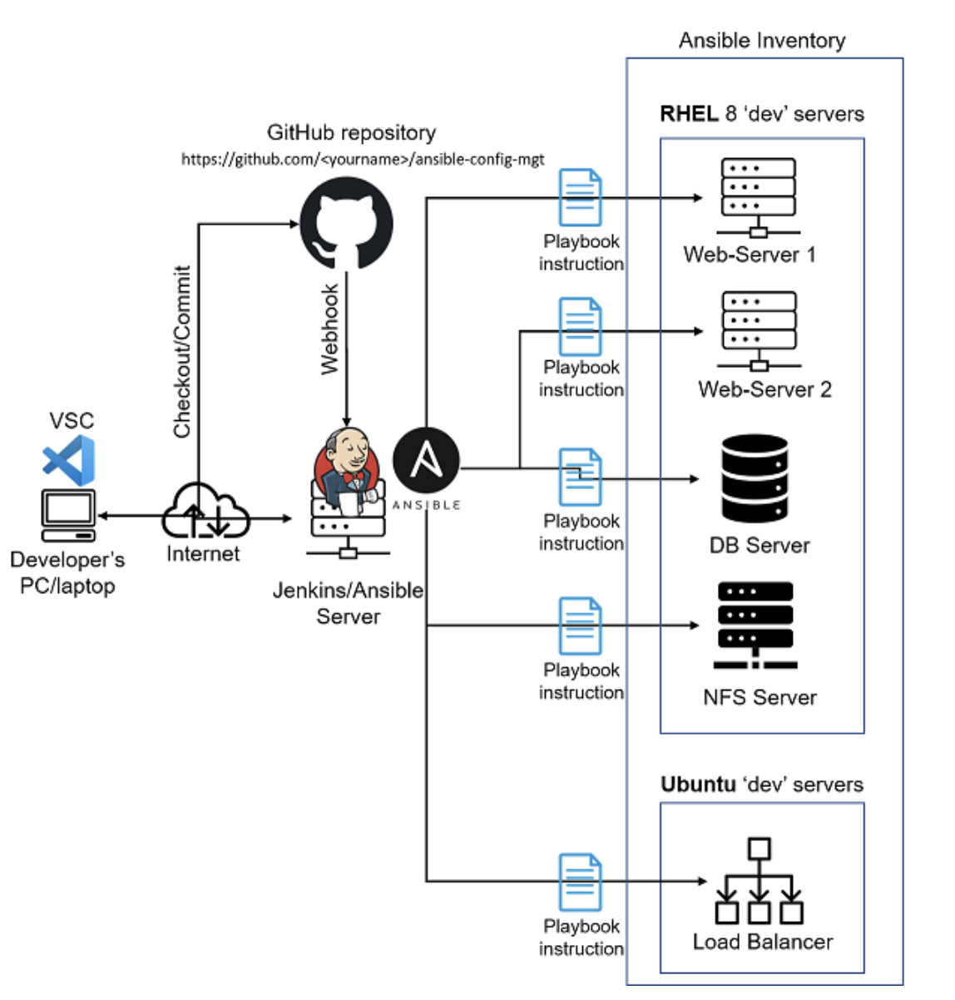

__Step 1: INSTALL AND CONFIGURE ANSIBLE ON EC2 INSTANCE__

1. Update the Name of the Jenkins instance to "Jenkins-Ansible"
2. Create a new repository in Github called "ansible-config-mgt"
3. Install Ansible and check the version installed.

```SHELL
sudo apt update
sudo apt install ansible -y
```
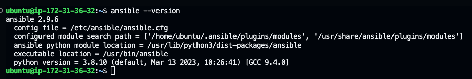

4. Configure Jenkins build job to save your repository content every time you change it.

Create a new Freestyle project called "ansible-config-mgt" in Jenkins and point it to your ‘ansible-config-mgt’ repository.

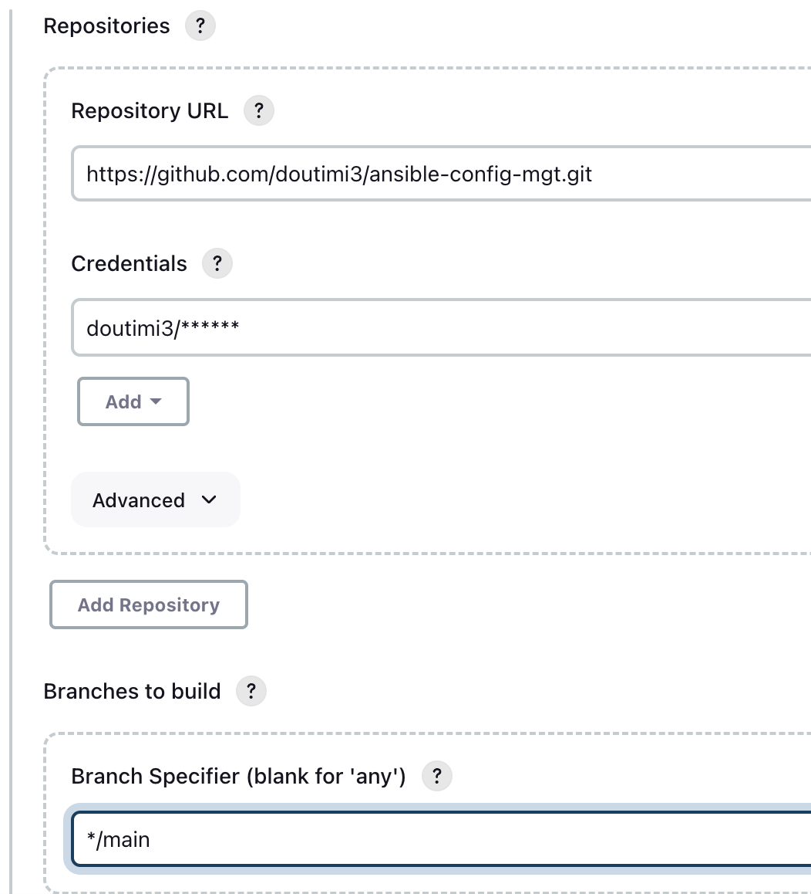

Configure Github Webhook to trigger ansible build.

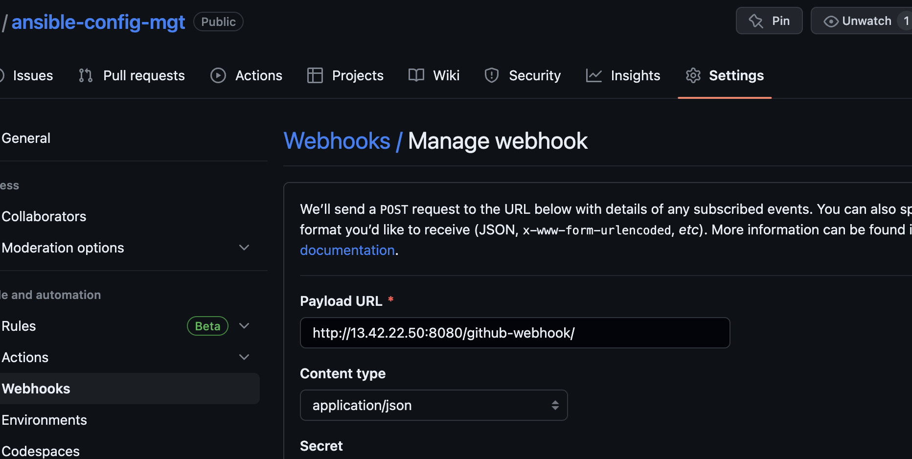

On the project, Configure triggering the job from GitHub webhook:

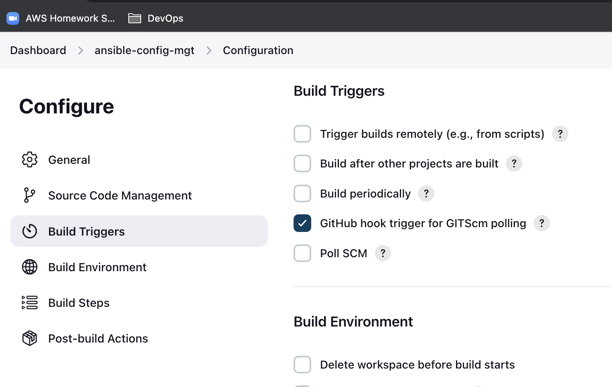

Configure "Post-build Actions" to archive all the files – files resulted from a build are called "artifacts".

Click on "Add post-build-action"
On the dropdown, click on "Archieve the Artifact"
Under "Archieve file" enter **


5. Test your setup by making some change in README.MD file in master branch and make sure that builds starts automatically and Jenkins saves the files (build artifacts) in following folder

```SHELL
sudo ls /var/lib/jenkins/jobs/ansible-config-mgt/builds/1/archive/
```

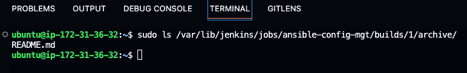

Now your setup will look like this:

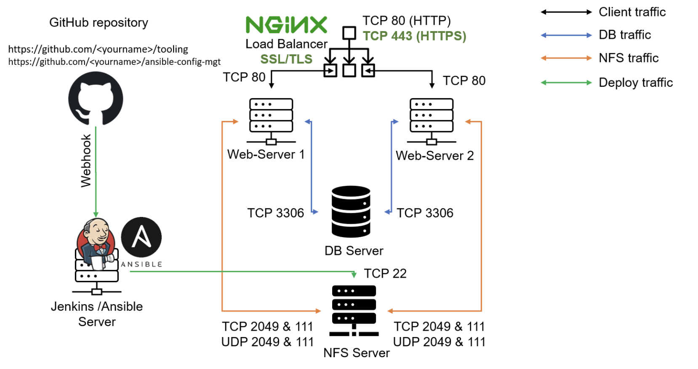

Every time you stop/start your Jenkins-Ansible server – you have to reconfigure GitHub webhook to a new IP address, in order to avoid it, it makes sense to allocate an Elastic IP to your Jenkins-Ansible server 

__Step 2: Prepare your development environment using Visual Studio Code__

I will be using vscode in my local computer to edit files and copy these files to the Jenkins-Ansible server afterwards. 

1. Clone down your ansible-config-mgt repo to your Jenkins-Ansible instance

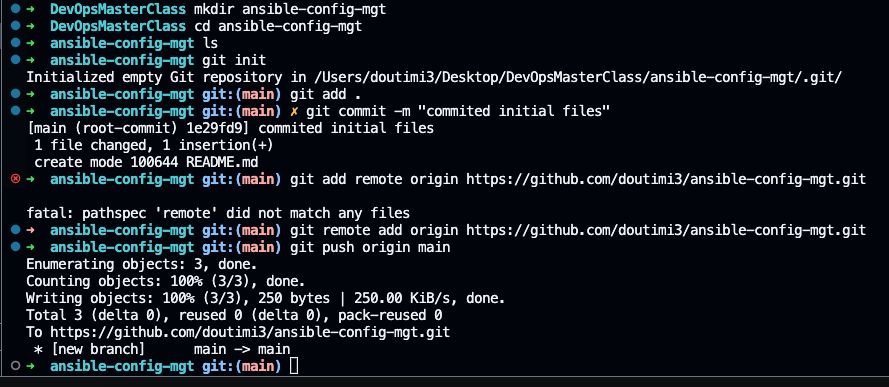

__STEP 3: BEGIN ANSIBLE DEVELOPMENT__

1. In your ansible-config-mgt GitHub repository, create a new branch that will be used for development of a new feature.
2. Checkout the newly created feature branch to your local machine and start building your code and directory structure
3. Create a directory and name it playbooks – it will be used to store all your playbook files.
4. Create a directory and name it inventory – it will be used to keep your hosts organised.
5. Within the playbooks folder, create your first playbook, and name it common.yml
6. Within the inventory folder, create an inventory file for each environment (Development, Staging Testing and Production)

__Step 4: Set up an Ansible Inventory__

An Ansible inventory file defines the hosts and groups of hosts upon which commands, modules, and tasks in a playbook operate.

In the inventory/dev file to start configuring your development servers. Ensure to replace the IP addresses according to your own setup.

```YAML
nfs-server ansible_host=<NFS-Server-Private-IP-Address>
db-server ansible_host=<db-Server-Private-IP-Address>
web-server1 ansible_host=<Web-Server1-Private-IP-Address>
web-server2 ansible_host=<Web-Server2-Private-IP-Address>
alb-server ansible_host=<alb-server-Private-IP-Address>

[nfsgroup]
nfs-server 

[dbgroup]
db-server

[webgroup]
web-server1
web-server2

[albgroup]
alb-server

[nfsgroup:vars]
ansible_user=ec2-user

[dbgroup:vars]
ansible_user=ubuntu

[webgroup:vars]
ansible_user=ec2-user

[albgroup:vars]
ansible_user=ubuntu

[devops_tooling:children]
dbgroup
nfsgroup
webgroup
albgroup

[devops_tooling:vars]
ansible_ssh_private_key_file=~/ansible-config-mgt/<PrivateKey>.pem

```

Ansible uses TCP port 22 by default, which means it needs to ssh into target servers from Jenkins-Ansible host. To be able to do this, copy SSH key for all servers to the ansible control server. In this project I am using one private key for all servers so this will be copied into the ansible server.

```
scp ~/Desktop/DevOpsMasterClass/keypair.pem ubuntu@<ip address>:~/
```
ssh into your Jenkins-Ansible server using ssh-agent

```SHELL
ssh -i /path/to/local/keypair.pem ubuntu@,public ip>
```

For RHEL servers the username is ec2-user while that of ubuntu servers is ubuntu. This distinction have been made in the inventory file created previously by specifying the username for each server group.

__Step 5: Create a Common Playbook__

In common.yml playbook you will write configuration for repeatable, re-usable, and multi-machine tasks that is common to systems within the infrastructure.

```YAML
---
- name: update web, and nfs
  hosts: webgroup, nfsgroup
  become: true

  tasks:
    - name: ensure wireshark is at the latest version
      yum:
        name: wireshark
        state: latest

- name: update ALB and DB server
  hosts: dbgroup, albgroup
  remote_user: ubuntu

  tasks:
    - name: Update apt repo
      apt:
        update_cache: yes

    - name: ensure wireshark is at the latest version
      apt:
        name: wireshark
        state: latest

```

Create an ansible.cfg file to set the default configuration parameters for all playbooks in "playbook" directory. change to "~/ansible-config-mgt/playbooks" directory and create "ansible.cfg" file.

```
[defaults]
host_key_checking = False
inventory = ~/ansible-config-mgt/inventory/
forks = 5
log_path = /var/log/ansible.log

[privilege_escalation]
become=True
become_method=sudo
#become_user=root
become_ask_pass=False
```

To run the playbook, ensure you are in the "~/ansible-config-mgt/playbooks" directory and run the below the command:

```SHELL
ansible-playbook common.yaml
```

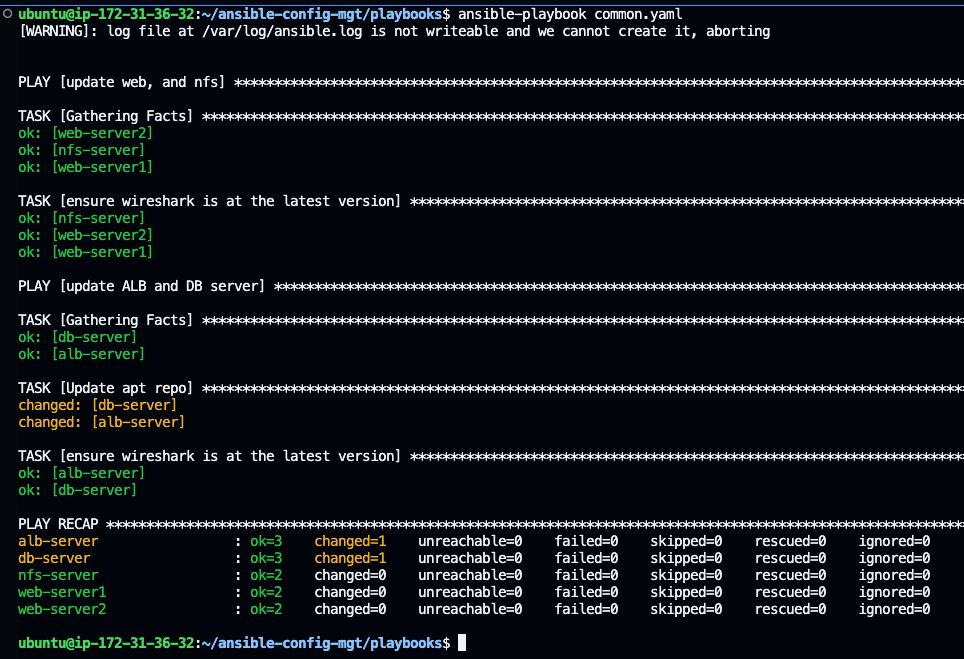

Add the following tasks to the above playbook:

* Create a directory and a file inside it
* Change timezone on all servers
* Run some shell script

Create a new folder called script and add a simple command to create a directory called "dir_from_script" using this script

```SHELL
mkdir -p ~/ansible-config-mgt/scripts
touch ~/ansible-config-mgt/scripts/sample_script.sh
```
Add the below line to the sample script

```SHELL
#!/usr/bin/bash
sudo mkdir -p ~/dir_from_script
```

Add the below lines to the common.yaml playbook and execute the playbook:

```YAML
- name: Create a new directory and file, change timezone and run a script
  hosts: all
  become: true
  tasks:
    - name: Create a new directory
      file:
        path: ~/testdir
        state: directory
        mode: "0755"

    - name: Create a new file inside the directory
      file:
        path: ~/testdir/sample_file.yaml
        state: touch

    - name: Change timezone to London
      timezone:
        name: Europe/London 

    - name: sample_script.sh to remote server
      copy:
        src: ~/ansible-config-mgt/scripts/sample_script.sh
        dest: ~/sample_script.sh
        mode: "0755"

    - name: Run setup_webserver.sh on remote server
      shell: ~/sample_script.sh

```

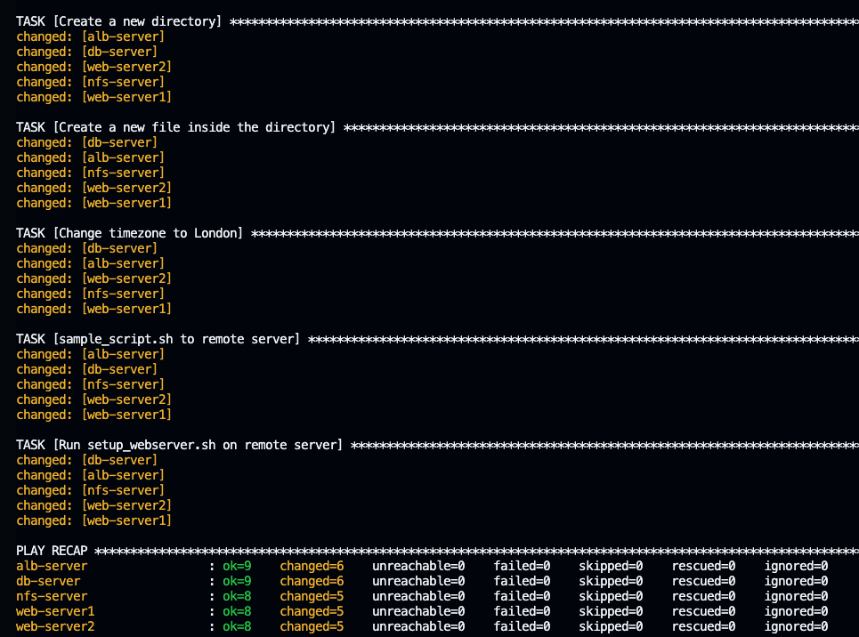

__Step 6: Update Git with the Latest Code__

1. Use git commands to add, commit and push your branch to GitHub.

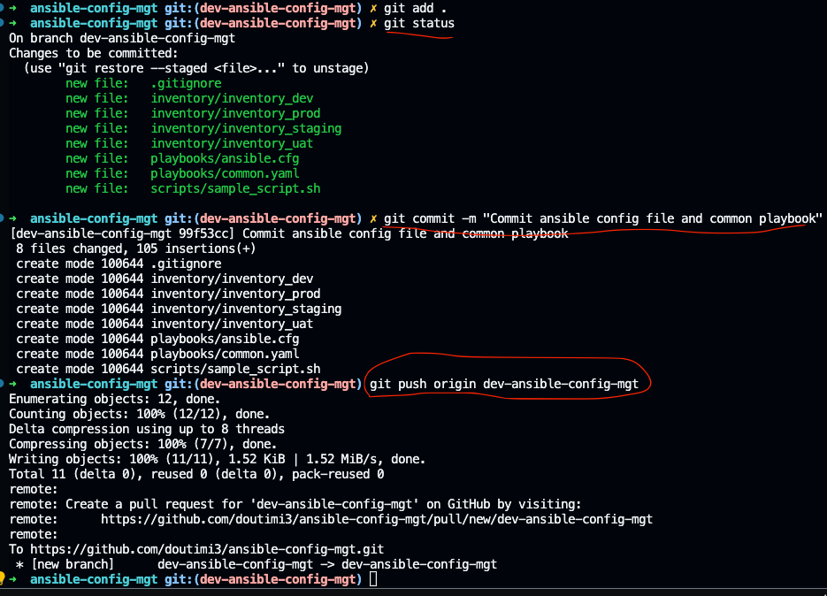

2. Create a Pull request (PR)

* Go to the original repository's page on GitHub and click the "New pull request" button.
* Select the branch with the changes you want to submit as the "head" branch and the original repository's main branch as the "base" branch.
* Review your changes and make sure everything looks good.
* Submit the pull request by clicking the "Create pull request" button.

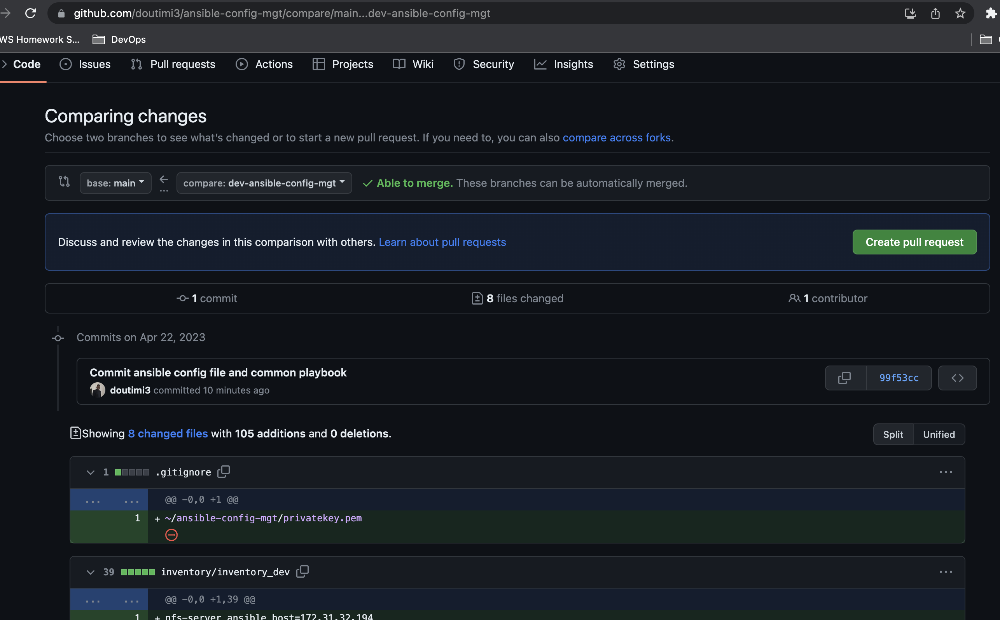

3. Review changes and merge to main branch

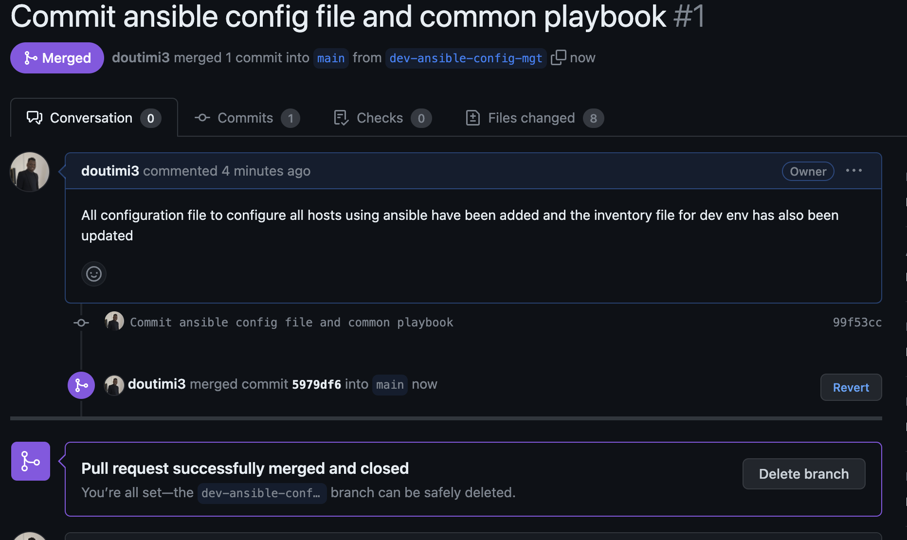

4. Head back on your terminal, checkout from the feature branch into the master, and pull down the latest changes.

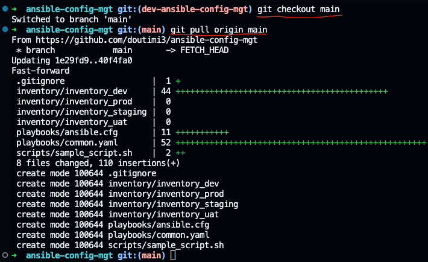

5. Once your code changes appear in main branch – Jenkins will do its job and save all the files (build artifacts) to /var/lib/jenkins/jobs/ansible/builds/<build_number>/archive/ directory on Jenkins-Ansible server.


__Step 7: Run First Ansible Test__

Verify that the playbook ran successfully:

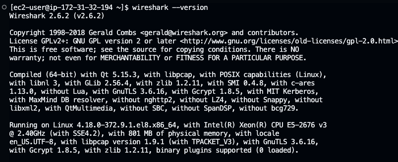


__CREDIT__

[Darey.io DevOps Master Class](darey.io)


